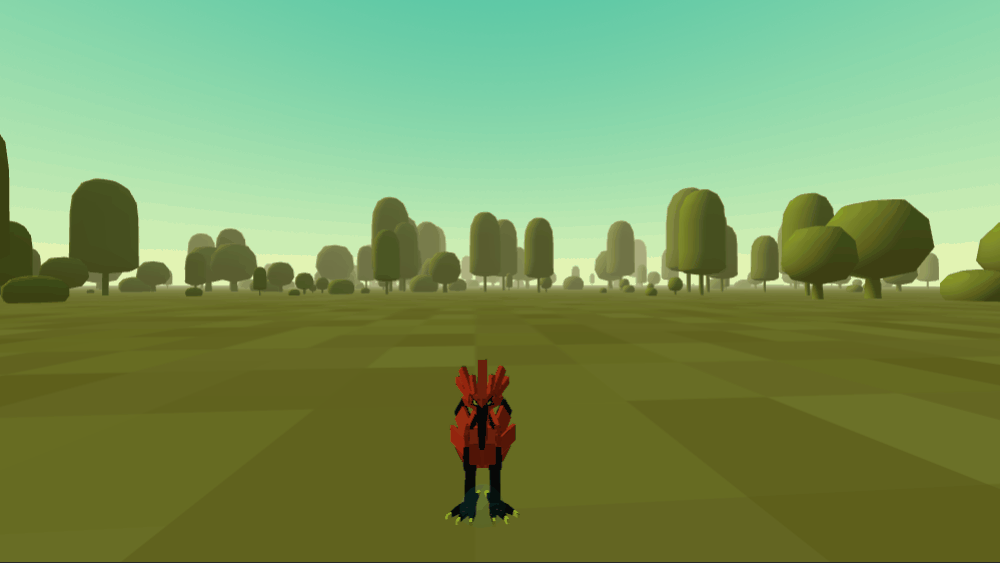
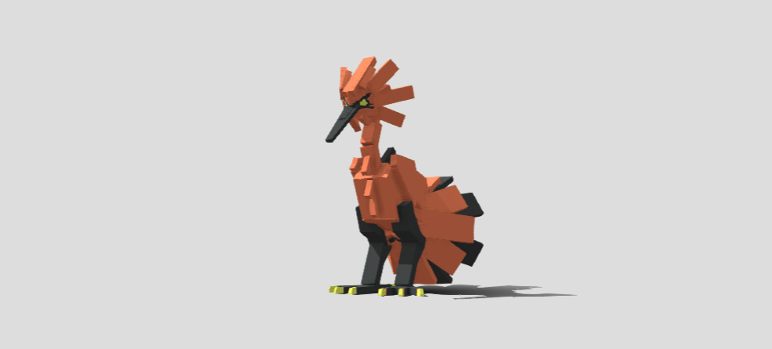

# Look At and Movement A-Frame by Click

In this project I tried to press something on the ground and get a certain point which then the 3D object will follow or seem to walk to that point. Here I use the animation and lookAt method from Three.js wrapped in an A-Frame.

## Demo

## 3D Model

I get a 3D model from Sketchfab, created by _Master Galanodel_ :

Under license `CC Attribution`.

https://sketchfab.com/3d-models/zapdos-galarian-589a2cefe1e442228f62292b8cb18772

